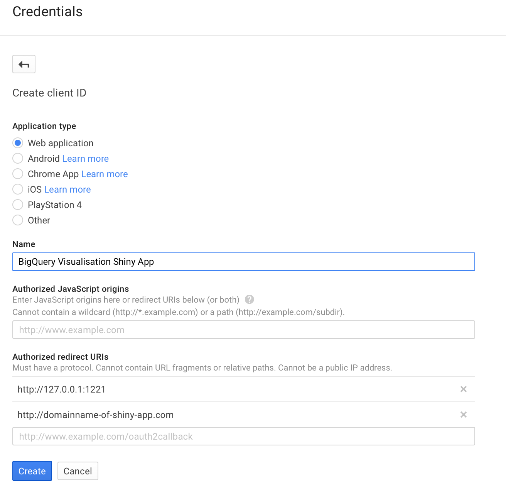

# BigQuery-Visualiser
A Shiny app to visualise BigQuery data in R.  

Open sourced so you can deploy on your own Shiny server.

## Introduction

After releasing the public Shiny app [BigQuery Visualiser](https://mark.shinyapps.io/bigquery-viz/) Nov 2015, good feedback was how it couldn't be used by some organisations due to security policy to not let unknown apps access to your BigQuery account.  

Since there is not yet a read only BigQuery scope, one alternative is to allow a JSON upload for verification, but this is pending a [fix in httr](https://github.com/hadley/httr/issues/275)

This leaves this solution, allowing users to download their own copy of the Shiny app, for deployment on their own server. 

## Setup

* Clone this library to your own local computer
* Install dependencies:
```
install.packages("devtools")
devtools::install_github("MarkEdmondson1234/googleAuthR")
devtools::install_github("MarkEdmondson1234/bigQueryR")
```
* Create your own [Google Project in the Dev console](https://developers.google.com/console/help/new/)
* The BigQuery API is automatically enabled for new projects, but if using an old project [enable it](https://cloud.google.com/bigquery/sign-up).
* [Set up billing](https://console.cloud.google.com/billing) - this is needed if you are doing anything other than free public queries.  The bigQueryR library has no billing enabled so can only query the free public datasets.
* Create your OAuth2 keys:  This app needs [OAuth2.0 for Web Server Applications](https://developers.google.com/api-client-library/python/auth/web-app).  
- I recommended setting up a local redirect URI at 127.0.0.1:1221 for testing, and one with the URL of where your app will eventually be deployed.
- The setup should look something like this:



* Update the `server.R` file to include your credentials.  The comments at the top of the file are reproduced below:

```
  ## The bigQueryR client Ids do not have billing enabled, 
  ## so to work with your own data you need to replace the below with your own
  ## Google API console keys with billing enabled. Do that here:
  ## https://console.developers.google.com/apis/credentials/oauthclient

  options("googleAuthR.webapp.client_id" = getOption("bigQueryR.webapp.client_id"))
  options("googleAuthR.webapp.client_secret" = getOption("bigQueryR.webapp.client_secret"))
  
  ## Once you have made your keys comment out the above options and comment in the below 
#   options("googleAuthR.webapp.client_id" = "YOUR_CLIENT_ID_FOR_OAUTH_TYPE_WEB_APPLICATION")
#   options("googleAuthR.webapp.client_secret" = "YOUR_CLIENT_SECRET_FOR_OAUTH_TYPE_WEB_APPLICATION")
```


* Launch the app locally using:
```
shiny::runApp(port=1221)
```

...where the variable port is equal to the one you set up in the Google Dev Console (1221 in this example).

For Shiny server deployment onto the web no port is needed.

* Customise the ui.R and server.R for your own needs.
* Deploy to your own local [Shiny server](https://www.rstudio.com/products/shiny/shiny-server/) or [shinyapps.io](http://shinyapps.io)

## Feedback

If you have any improvements such as new plot types or feedback raise an issue or submit a pull request.  
